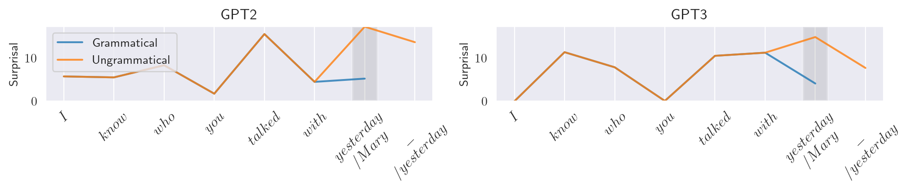

# Large Language Models and the Argument from the Poverty of the Stimulus 

Code and data for [Large Language Models and the Argument from the Poverty of the Stimulus](https://ling.auf.net/lingbuzz/006829).

## Getting started

* Install Python 3.9 and required packages:
```
pip install -r requirements.txt
```

## Usage examples:

* Plotting surprisal curves for one or more models:
```python
import viz

models = ("gpt2", "gpt3")
sentences = (
    "I know who you talked with yesterday",  # Grammatical.
    "I know who you talked with _ Mary _ yesterday",    # Ungrammatical.   
)

labels = ("Grammatical", "Ungrammatical")
viz.plot_surprisals(sentences, models=models, labels=labels)
```
Result:



## Running filler/gap experiments

The grammars for the tasks described in the paper are defined in `grammars.toml`.

Running `run_phenomenon.py` runs all sentences generated from the grammar, for all combinations of [±filler, ±gap].

To get surprisal values for all four conditions on specific models, and calculate the interaction values:
```bash
python run_phenomenon.py --phenomenon {"ATB", "PG"} --models <comma separated list of models> --names {'tiny', 'small', 'large'}   
```
Supported models: `bert-base-uncased`, `bert-large-uncased`, `gpt2`, `gpt3`, `grnn`, `childes_transformer_<i>`, `childes_lstm_<i>`.

To run the experiments from the paper, for example for gpt2 and gpt3, run:

```bash
python run_phenomenon.py --phenomenon ATB --models gpt2,gpt3 --names tiny
python run_phenomenon.py --phenomenon PG --models gpt2,gpt3 --names small
```

Results are saved to `data`, for example:
* `ATB__model__gpt3__cfg_tiny_v2023-10-30a.{csv,pickle}` – surprisal values for each sentence generated by the grammar.
* `ATB__model__gpt3__cfg_tiny_v2023-10-30a_full_interaction.{csv,pickle}` – surprisal interaction values for each tuple of four [±filler, ±gap] sentences.

## Paper data

* To reproduce the plots and stats reported in the paper, see notebooks in `notebooks`.

* Logs for the Transformer retraining task are in `data/logs.zip`.

* For the full retrained Transformer checkpoints, write to `nur.lan@ens.psl.eu`.


### Raw surprisal values

All the sentences and raw surprisal values for the experiments reported in the paper are found under `data/model_surprisals.zip`.

To prevent test set contamination by large language models who train on crawled data and then test on it, all dataset files are zipped and password-protected.
The password to all zip files is `llm_pos`.

See [Jacovi et al., 2022 – Practical Strategies for Mitigating Data Contamination by Evaluation Benchmarks](https://arxiv.org/abs/2305.10160).


## Model setup

* To use GPT-3, add your OpenAI API key as an environment variable: 
```
export OPENAI_KEY="..."
```

### `lm-zoo` models

The models GPT-2, GRNN, and JRNN are run using Docker based on the [lm-zoo](https://github.com/cpllab/lm-zoo) project.

Pull the following images to be able to get inferences from GPT2, GRNN, JRNN:
```
cpllab/language-models:gpt2
cpllab/language-models:jrnn
cpllab/language-models:grnn
```

* ! JRNN is extremely slow and takes 1-2 minutes per one sentence inference.  


### CHILDES models

Run `./get_childes_models.sh` to download the CHILDES LSTM/Transformer models from Yedetore et al. (2023).

Running inference on CHILDES models:

Clone original repo:
```
git clone https://github.com/adityayedetore/lm-povstim-with-childes/
```

And add its location to PYTHONPATH:
```
export PYTHONPATH="$PYTHONPATH:/PATH/TO/lm-povstim-with-childes/src"
```


## Retraining task

### Getting the original English Wikipedia training data:

```bash
WIKI_DATA_DIR="./data/retraining/wikipedia"
mkdir -p $WIKI_DATA_DIR

wget -x https://dl.fbaipublicfiles.com/colorless-green-rnns/training-data/English/train.txt -O $WIKI_DATA_DIR/train.txt.original
wget -x https://dl.fbaipublicfiles.com/colorless-green-rnns/training-data/English/test.txt -O $WIKI_DATA_DIR/test.txt.original
wget -x https://dl.fbaipublicfiles.com/colorless-green-rnns/training-data/English/valid.txt -O $WIKI_DATA_DIR/valid.txt.original
wget -x https://dl.fbaipublicfiles.com/colorless-green-rnns/training-data/English/vocab.txt -O $WIKI_DATA_DIR/vocab.txt
```

### Getting the Yedetore CHILDES training data:

* Note: the vocab.txt file provided in pretraining.zip is incorrect. The correct file is at `http://www.adityayedetore.com/childes-project/vocab.txt`. 

```bash
CHILDES_DATA_DIR="./data/retraining/childes"
mkdir -p $CHILDES_DATA_DIR
cd /tmp/

wget http://www.adityayedetore.com/childes-project/pretraining.zip
unzip pretraining.zip
cp pretraining/train.txt $CHILDES_DATA_DIR/train.txt.original
cp pretraining/valid.txt $CHILDES_DATA_DIR/valid.txt.original
cp pretraining/test.txt $CHILDES_DATA_DIR/test.txt.original

cd $CHILDES_DATA_DIR
wget http://www.adityayedetore.com/childes-project/vocab.txt # Correct file.
```

### Running retraining for ATB/PG:

```bash
PYTHONPATH="." python retraining.py --phenomenon ATB --names tiny --samples_per_condition 100 --seed 1000 --context_size 30 --dataset_name "wikipedia"
PYTHONPATH="." python retraining.py --phenomenon PG --names small --samples_per_condition 100 --seed 1000 --context_size 30 --dataset_name "wikipedia"
```

## Caching surprisal values

Inference is costly, so we cache surprisal values to Redis. 
If you're running a large scale experiment like the ones in the paper, it's better to run redis before: `$ redis-server &`.


## Modified external sources

The project uses modified versions of the following projects, under `modified_external_sources`:

### `lm-povstim-with-childes`
Source code for [Yedetore et al. (2023)](https://github.com/adityayedetore/lm-povstim-with-childes).

#### Changes made
- Changed `main.py` to support training on original dataset + extra sentences.


### `colorlessgreenRNNs`
Source code for [Gulordava et al.](https://github.com/facebookresearch/colorlessgreenRNNs/). 

#### Changes made
- Changed `dictionary_corpus.py` to support multiple text file sources.
 